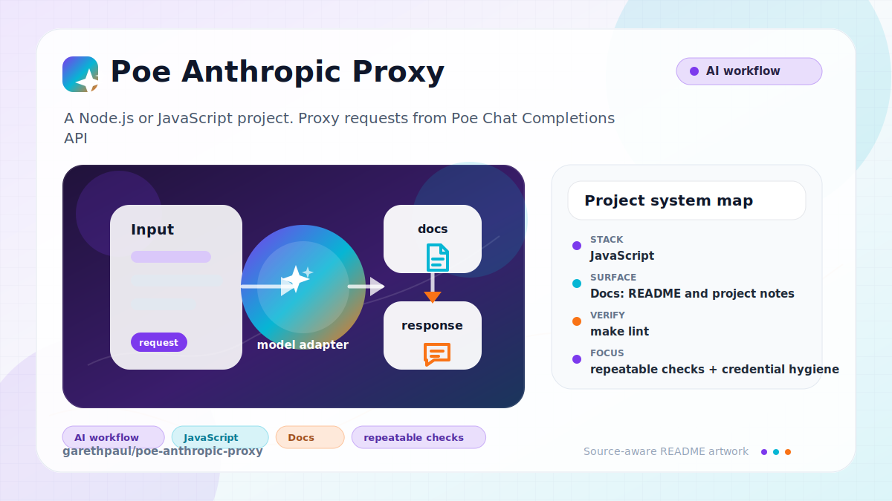

# poe-anthropic-proxy

<!-- README-OVERVIEW-IMAGE -->


## Overview

`garethpaul/poe-anthropic-proxy` is a Node.js or JavaScript project. Proxy requests from Poe Chat Completions API to Anthropic Format

This README is based on the checked-in source, manifests, scripts, and repository metadata on the `main` branch. The project language mix found during review was: JavaScript (2).

## Repository Contents

- `README.md` - project overview and local usage notes
- `Makefile` - repository-level verification wrapper
- `package.json` - JavaScript dependency and script metadata
- `docs` - source or example code
- `package-lock.json` - JavaScript dependency and script metadata
- `SECURITY.md` - security reporting and disclosure guidance
- `test` - source or example code
- `VISION.md` - project direction and maintenance guardrails

Additional scan context:

- Source directories: docs, test
- Dependency and build manifests: package-lock.json, package.json
- Entry points or build surfaces: package.json, Makefile
- Test-looking files: docs/plans/2026-06-08-poe-anthropic-proxy-security-test-baseline.md, test/poe-proxy.test.js

## Getting Started

### Prerequisites

- Git
- Node.js 20 or newer and npm

### Setup

```bash
git clone https://github.com/garethpaul/poe-anthropic-proxy.git
cd poe-anthropic-proxy
npm ci
export POE_API_KEY=...
export POE_PROXY_API_KEY=...
```

`.env.example` lists the required upstream Poe key, inbound proxy key, and
localhost binding defaults. `POE_UPSTREAM_TIMEOUT_MS` configures the upstream
request timeout, accepts 1-300000 milliseconds, and defaults to 30000.
`POE_RATE_LIMIT_MAX` and `POE_RATE_LIMIT_WINDOW_MS` default to 60 requests per
60-second window per client address.

The setup commands above are derived from repository files. Legacy mobile, Python, or JavaScript samples may require older SDKs or package versions than a modern workstation uses by default.

## Running or Using the Project

`POE_MODEL` sets the default model when a request omits `model`.
`POE_MODEL_MAPPINGS_JSON` optionally supplies model mapping overrides as a JSON object of Anthropic model
names to Poe bot names. Valid entries override the built-in mappings; unknown
names still pass through unchanged. Configuration is limited to 16,384 bytes
and 100 safe nonempty string pairs, and malformed values stop startup without
printing mapping contents.

Built-in mappings:

- `claude-sonnet-4-20250514` -> `Claude-Sonnet-4`
- `claude-3-5-sonnet-20241022` -> `Claude-Sonnet-3.5`
- `claude-3-5-sonnet-20240620` -> `Claude-Sonnet-3.5`
- `claude-3-5-haiku-20241022` -> `Claude-Haiku-3.5`
- `claude-3-opus-20240229` -> `Claude-Opus-3`
- `claude-3-sonnet-20240229` -> `Claude-Sonnet-3`
- `claude-3-haiku-20240307` -> `Claude-Haiku-3`

- Run `npm start` for the default development command.
- Run `npm run dev` for the development server when that script is appropriate.
- The server binds to `127.0.0.1` by default. Set `HOST` explicitly only when
  you have a separate access-control boundary.
- Environment values are trimmed before use; blank credential values are treated
  as unset rather than as valid tokens.
- Call `/v1/messages` with `Authorization: Bearer $POE_PROXY_API_KEY`.
- Requests are rejected before upstream forwarding if either the inbound proxy
  token or upstream Poe key is missing.
- Requests exceeding the configured per-client window receive HTTP 429 before
  authentication, payload conversion, or Poe access.
- Every Poe fetch has a bounded upstream request timeout; pre-stream timeouts
  return a stable `504` response.
- Streaming translation buffers partial SSE lines and UTF-8 bytes across stream
  chunk boundaries so network segmentation cannot drop response content.
- Use `npm run lint`, `npm run build`, `make lint`, and `make build` as stable
  local aliases around the dependency-free syntax gate.
- Malformed non-streaming upstream responses are rejected with an explicit local
  error before response mapping continues.
- Upstream Poe error payloads keep the upstream status code and return a local
  status fallback when Poe sends an empty error body.
- Unexpected internal proxy failures return a stable generic 500 response
  instead of exposing fetch, mapping, or stream exception details.
- Unexpected internal proxy logs use a stable marker without exception details
  so collected logs do not retain credential-bearing runtime messages.
- Malformed Poe tool call arguments are rejected with an explicit local mapping
  error before Anthropic tool-use content is returned.
- Malformed Poe tool definitions are ignored before forwarding so bad request
  tool metadata does not crash payload conversion.
- Tool definitions with missing or invalid names or schemas are omitted locally
  instead of being forwarded to Poe.

Detected npm scripts:

- `npm run audit` - `npm audit --audit-level=moderate`
- `npm run build` - `node --check poe-proxy.js`
- `npm run dev` - `node --watch poe-proxy.js`
- `npm run lint` - `node --check poe-proxy.js`
- `npm run start` - `node poe-proxy.js`
- `npm run test` - `node --test`
- `npm run verify` - `npm run lint && npm test && npm run build && npm run audit`
- `scripts/check-baseline.sh` - repository baseline guard for package scripts,
  completed plans, and local secret/editor metadata

## Testing and Verification

Pinned hosted Linux validation runs `npm ci` and the full `make check` gate on
Node 20 and Node 24 without proxy credentials or live Poe requests.

Run the local verification gate before changing the proxy:

```bash
make lint
make build
make check
npm run lint
npm run build
npm run verify
scripts/check-baseline.sh
```

`make check` delegates to `npm run verify`, which runs syntax checks,
deterministic Node tests, the build alias, and `npm audit --audit-level=moderate`.
It then runs `scripts/check-baseline.sh` to verify package script wiring,
completed plan metadata, credential documentation, and local metadata ignores.
Make derives a canonical root from the checked-in Makefile, rejects caller
replacement of `MAKEFILE_LIST`, and ignores command-line or environment
`REPO_ROOT` and `NPM` redirection. Absolute `-f` paths remain supported from
unrelated working directories, including checkout paths with spaces and
apostrophes.
The tests do not require a live Poe API key or network access.
GitHub Actions installs dependencies with `npm ci` on Node 20 and Node 24 and
runs the same `make check` gate without live Poe credentials. Checkout does not
persist credentials, and the job uses an invalid upstream URL so accidental
network calls cannot target Poe.

When the required SDK or runtime is unavailable, use static checks and source review first, then verify on a machine that has the matching platform toolchain.

## Configuration and Secrets

The proxy implements a focused subset of Anthropic request semantics. See the
ignored Anthropic request fields contract in
[`docs/anthropic-request-field-support.md`](docs/anthropic-request-field-support.md)
for mapped, partially normalized, and ignored fields. Ignored fields are not
rejected and must not be treated as compatibility guarantees.

- Detected references to OpenAI. Keep API keys, OAuth credentials, tokens, and account-specific values in local configuration only.
- `POE_API_KEY` is the upstream Poe credential and must stay server-side.
- `POE_PROXY_API_KEY` is the inbound caller token required by `/v1/messages`.
- Programmatic `createServer()` usage must pass both values; the route returns
  `503` rather than forwarding with a missing upstream Poe key.
- `.env.example` documents placeholders for both credentials; replace them with
  private deployment values and do not commit real `.env` files.
- `HOST` defaults to `127.0.0.1`; avoid `0.0.0.0` unless the proxy is behind
  another authenticated boundary.
- Whitespace-only `POE_API_KEY` or `POE_PROXY_API_KEY` values are treated as
  missing credentials.
- Invalid `POE_UPSTREAM_TIMEOUT_MS` values fall back to the 30-second default.
- Invalid rate-limit values fall back to 60 requests per 60-second window;
  deployment overrides are bounded to 10000 requests and a one-hour window.
- Malformed non-streaming upstream responses are treated as local mapping errors
  instead of leaking generic property-access failures.
- Upstream Poe error payloads are returned without attempting success-response
  mapping, and empty error bodies get a status-based fallback message.
- Poe stream chunk boundaries are reconstructed before JSON parsing, including
  split multibyte text and a final line without a trailing newline.
- Streamed tool call argument fragments are forwarded as deltas and preserve
  their original order for Anthropic clients.
- Model mappings apply only to explicit entries; inherited JavaScript object
  properties remain ordinary upstream model names.
- Malformed Poe tool call arguments are treated as local mapping errors instead
  of leaking generic JSON parse failures.
- Malformed Poe tool definitions are ignored before forwarding instead of
  leaking generic request-shape failures.
- Invalid Poe tool names or schemas are treated as malformed definitions and
  omitted before forwarding.

## Security and Privacy Notes

- Review changes touching authentication or token handling; examples from the scan include docs/plans/2026-06-08-poe-anthropic-proxy-security-test-baseline.md, poe-proxy.js, test/poe-proxy.test.js.
- Review changes touching external API calls or credential-adjacent configuration; examples from the scan include docs/plans/2026-06-08-poe-anthropic-proxy-security-test-baseline.md, poe-proxy.js, test/poe-proxy.test.js.
- Review changes touching network requests, sockets, or service endpoints; examples from the scan include poe-proxy.js, test/poe-proxy.test.js.
- Review changes touching file, media, JSON, XML, CSV, OCR, or data parsing; examples from the scan include docs/plans/2026-06-08-poe-anthropic-proxy-security-test-baseline.md, poe-proxy.js, test/poe-proxy.test.js.
- Review changes touching database, model, or persistence code; examples from the scan include docs/plans/2026-06-08-poe-anthropic-proxy-security-test-baseline.md, poe-proxy.js, test/poe-proxy.test.js.

## Maintenance Notes

- See `SECURITY.md` for vulnerability reporting and safe research guidance.
- See `VISION.md` for project direction and contribution guardrails.
- See `CHANGES.md` for maintenance history.
- See `docs/plans/2026-06-08-inbound-proxy-auth.md` for the inbound proxy
  authorization baseline.
- See `docs/plans/2026-06-09-poe-proxy-env-normalization.md` for environment
  normalization guardrails.
- See `docs/plans/2026-06-10-poe-proxy-upstream-error-payloads.md` for
  upstream Poe error payload handling.
- See `docs/plans/2026-06-09-scripted-baseline-check.md` for the scripted
  repository baseline guard.
- See `docs/plans/2026-06-10-ci-baseline.md` for the GitHub Actions baseline.
- See `docs/plans/2026-06-12-credential-free-hosted-validation.md` for the
  exact credential-free workflow contract.

## Contributing

Keep changes small and tied to the project that is already present in this repository. For code changes, document the toolchain used, avoid committing generated dependency directories or local configuration, and update this README when setup or verification steps change.
